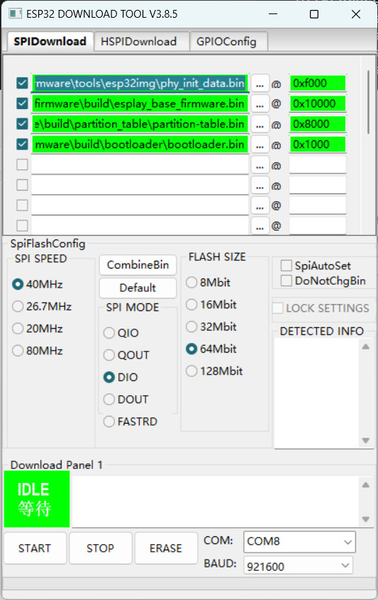

# esplay-base-firmware mod

Bootloader or sdcard flasher for ESPlay HW ESP32 based device.

The code based on odroid go base firmware, modified using hardware drivers to be compatible with [esplay-hardware].

## 修改内容

- 禁用开机动画
- UI微调
- 消除所有警告

## 编译

安装 esp-idf-v4.4 环境 [ESP-IDF 编程指南 - ESP32 - — ESP-IDF 编程指南 v4.4.3 文档 (espressif.com)](https://docs.espressif.com/projects/esp-idf/zh_CN/v4.4.3/esp32/index.html)

添加下述代码到 ESP-IDF 相关文件：

components/spi_flash/include/esp_partition.h
```
void esp_partition_reload_table();
#endif /* __ESP_PARTITION_H__ */
```

components/spi_flash/partition.c
```
void esp_partition_reload_table()
{
    if (!SLIST_EMPTY(&s_partition_list))
    {
        _lock_acquire(&s_partition_list_lock);

        // Remove all entries
        while(!SLIST_EMPTY(&s_partition_list))
        {
            partition_list_item_t* item = SLIST_FIRST(&s_partition_list);
            SLIST_REMOVE_HEAD(&s_partition_list, next);

            free(item);
        }

        _lock_release(&s_partition_list_lock);
    }
}

```


```sh
#get_idf
#idf.py clean
idf.py build
# 刷入
idf.py -p /dev/ttyUSB0 -b 921600 flash
```



## Linux 权限问题 /dev/ttyUSB0

刷入命令：`idf.py -p /dev/ttyUSB0 -b 921600 flash` 会遇到没有权限的问题，此时可以用 `sudo` 来提权，或者输入以下命令，重启解决（[与 ESP32 创建串口连接](https://docs.espressif.com/projects/esp-idf/zh_CN/latest/esp32/get-started/establish-serial-connection.html#linux-dialout-group) ）
- Ubuntu:  `sudo usermod -a -G dialout $USER`
- ArchLinux: `sudo usermod -a -G uucp $USER`

---

编译过程中会因为警告导致编译失败，禁用 make 警告重新编译：
- 搜索 `-Werror=all` 替换为 ` `（空字符串）
- 搜索 `-Werror` 替换为 `-Wno-error`
- 然后再次 `make`

esplay-hardware: https://github.com/pebri86/esplay-hardware
